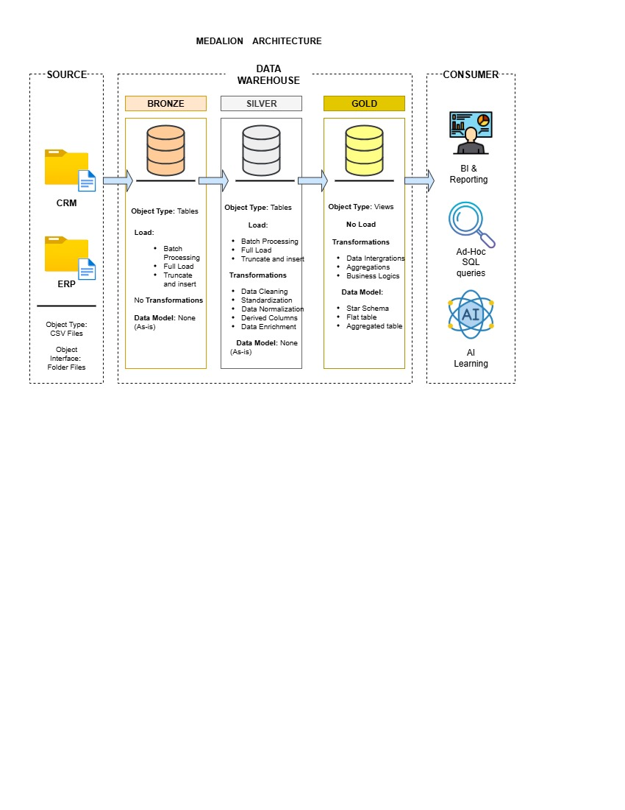
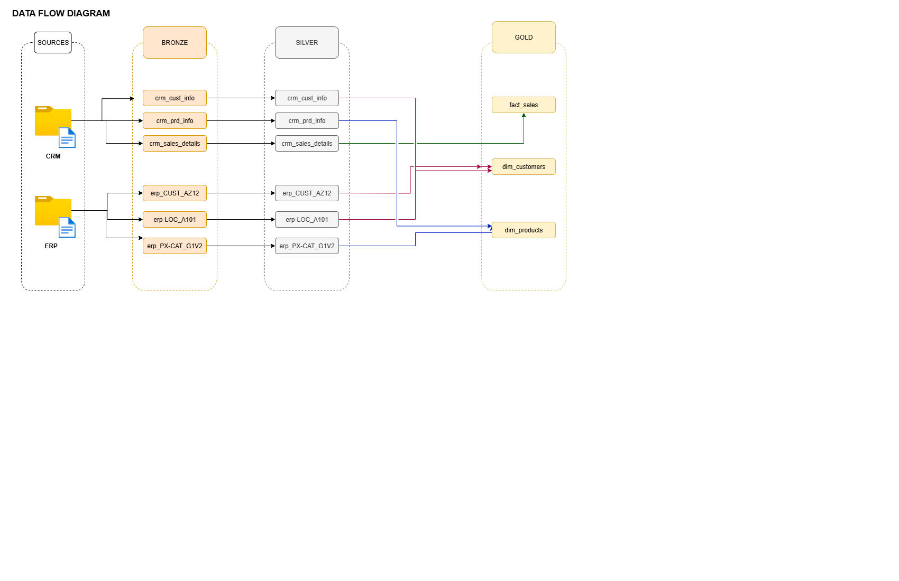
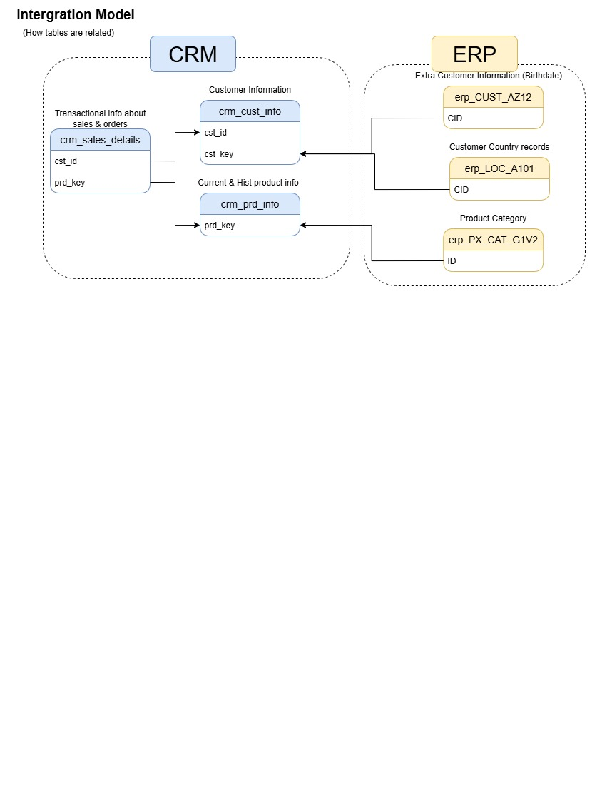

# 🏢 Enterprise Data Warehouse

Welcome to Data Warehouse repository! This project implements a scalable, layered architecture for ingesting, 
transforming, and serving data from CRM and ERP systems. It supports analytics, reporting, and machine learning through a structured pipeline based on the **Medallion Architecture**.

---

## 🧱 Architecture Overview

We use the Medallion Architecture to organize our data warehouse into three progressive layers:

| Layer   | Purpose                                | Object Type | Load Type                  | Transformations                          | Data Model         |
|---------|----------------------------------------|-------------|----------------------------|------------------------------------------|--------------------|
| Bronze  | Raw data ingestion                     | Tables      | Batch, Full, Incremental   | None                                     | Raw (No model)     |
| Silver  | Cleansing and normalization            | Tables      | Batch, Full, Incremental   | Joins, filtering, deduplication          | Normalized         |
| Gold    | Business-level aggregation and serving | Views       | No Load (virtual layer)    | Aggregation, integration                 | Star Schema, Aggregated |

---

## 📥 Data Sources

This warehouse integrates data from two primary systems:

- **CRM System**: Customer profiles, sales transactions, product details
- **ERP System**: Extended customer attributes, product categories, general ledger codes

Supported formats include:
- CSV
- Excel
- JSON
- Folder-based ingestion

---

## 🔄 Data Flow

The pipeline progresses through the following stages:

### 🔹 Bronze Layer – Raw Ingestion
Tables:
- `crm_cust_raw`, `crm_cust_attr`, `crm_sales_raw`, `crm_sales_details`
- `erp_cust_attr`, `erp_sales_raw`, `erp_sales_attr`, `erp_glcode_attr`

These tables capture unprocessed data directly from source systems. No transformations are applied at this stage.

### 🔸 Silver Layer – Cleansing & Structuring
Tables:
- `slv_cust_attr`, `slv_sales_attr`, `slv_sales_raw`, `slv_glcode_attr`

Here, we apply:
- Deduplication
- Filtering
- Joins across CRM and ERP datasets
- Basic normalization

### 🟡 Gold Layer – Business-Ready Views
Tables:
- `fact_sales`, `dim_customers`, `dim_products`

These are curated views designed for:
- BI dashboards
- Ad-hoc SQL queries
- AI/ML model training

They follow a **star schema** for optimal performance and usability.

---

## 🔗 Integration Model

This diagram illustrates how CRM and ERP tables relate:

### CRM Relationships:
- `crm_cust_info.cust_id` → `crm_sales_details.cust_id`
- `crm_sales_details.prd_key` → `crm_prd_info.prd_key`

### ERP Relationships:
- `erp_CUST_AZ12.CID` and `erp_LOC_AT01.CID` provide extended customer attributes
- `erp_PX_CAT_G1V2.ID` links product categories

These relationships enable unified customer and product views across systems.

---

## 🎯 Use Cases

This data warehouse supports a range of data consumers:
- 📈 **BI & Reporting**: Dashboards, KPIs, trend analysis
- 🔍 **Ad-Hoc SQL Queries**: Exploratory analysis
- 🤖 **AI/ML Models**: Predictive analytics, segmentation

---

## 🚀 Getting Started

To deploy or extend this pipeline:
1. Connect your CRM and ERP data sources.
2. Configure ingestion jobs for Bronze layer.
3. Define transformation logic for Silver layer.
4. Create Gold views using business rules.
5. Plug into your BI tool or ML pipeline.

---

## 📚 Documentation

- `docs/medallion_architecture.md`: Layer definitions and transformation logic
- `docs/integration_model.md`: Table relationships and join keys
- `docs/data_flow.md`: End-to-end pipeline flow

---

## 🙌 Contributing

This project has an MIT licence. Please submit pull requests for:
- New transformations
- Schema updates
- Performance optimizations

---
